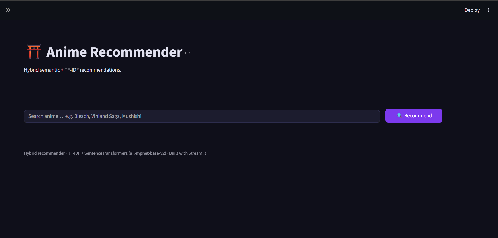
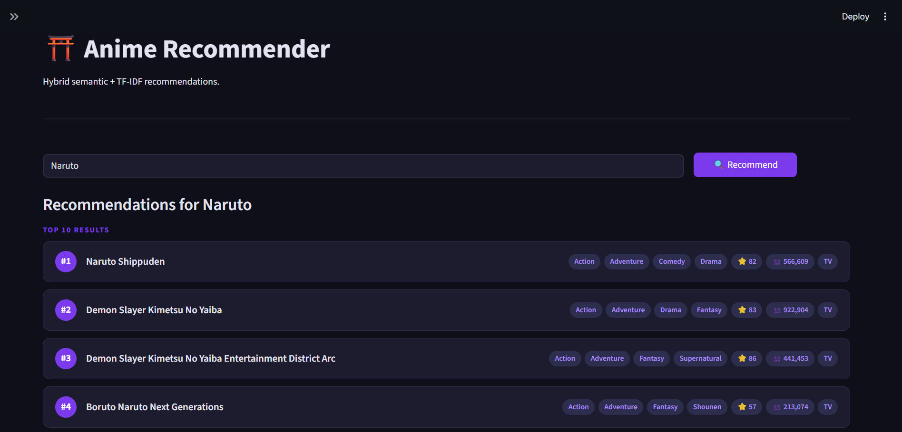
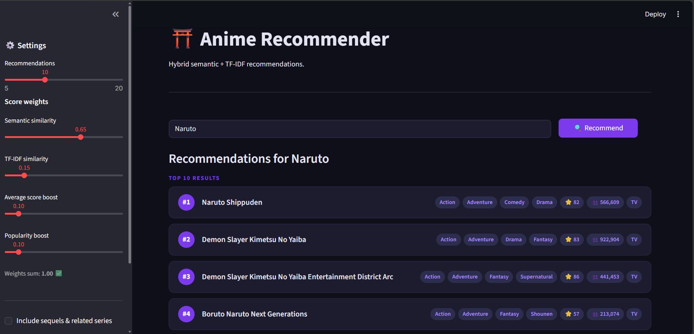

# ⛩️ Anime Recommendation System

A **Hybrid Anime Recommender System** built using **Machine Learning and NLP**, combining semantic understanding with traditional similarity techniques to deliver accurate and meaningful anime recommendations.

---

## 🚀 Features

* 🔍 Search any anime and get similar recommendations
* 🧠 Hybrid recommendation approach:

  * Semantic similarity (transformer embeddings)
  * TF-IDF similarity
* ⚖️ Weighted ranking system
* 🎯 Option to filter similar series
* 🌙 Clean and interactive interface

---

## 🧠 How It Works

The system combines multiple techniques:

* **Semantic Similarity** → captures meaning using embeddings
* **TF-IDF Similarity** → captures textual similarity
* **Score & Popularity Boost** → improves ranking quality

### Final Score:

Final Score =
(w1 × Semantic Similarity) +
(w2 × TF-IDF Similarity) +
(w3 × Score) +
(w4 × Popularity)

---

## 📁 Project Structure

```
Anime-Recommendation-System/
│
├── Data/
│   ├── Anime_Dataset_Raw.csv
│   └── Anime_Dataset_Cleaned.csv
│
├── Recommender/
│   └── Anime_recommender.py
│
├── model/
│   └── anime_model.pkl
│
├── README.md
├── requirements.txt
└── .gitignore
```

---

## 📊 Dataset(Fetched using public AniList API)

### Raw Data

* **File:** `Data/Anime_Dataset_Raw.csv`
* Original dataset containing anime metadata

### Processed Data

* **File:** `Data/Anime_Dataset_Cleaned.csv`
* Cleaned dataset used for model training

### Preprocessing Steps:

* Removed null values
* Cleaned text fields
* Normalized score and popularity
* Prepared features for recommendation

---

## 🛠️ Tech Stack

* Python
* Streamlit
* Scikit-learn
* Sentence Transformers
* Pandas / NumPy

---

## ▶️ Run Locally

### 1. Clone the repository

```
git clone https://github.com/PratyushSahu9000/Anime-Recommendation-System.git
cd Anime-Recommendation-System
```

---

### 2. Install dependencies

```
pip install -r requirements.txt
```

---

### 3. Run the application

```
python Recommender/Anime_recommender.py
```

---

## ⚠️ Model File Notice

The model file:

```
model/anime_model.pkl
```

File is not vailable dur to large size. Generate it using the provided notebook.

---

## 📸 Demo

### 🏠 Home Screen


### 🔍 Search Results


### ⚙️ Sidebar Controls
 

---

## 💡 Key Highlights

* Hybrid recommender system
* Combines NLP + ML techniques
* Real-world ranking system
* Clean modular structure

---

## 🔮 Future Improvements

* Deep Learning-based recommender
* User personalization
* Web deployment (Streamlit Cloud)
* API integration (FastAPI)

---

## 🤝 Contributing

Feel free to fork and improve this project.

---

## ⭐ Support

If you like this project, give it a ⭐ on GitHub!

---

## 👨‍💻 Author

**Pratyush Sahu**
B.Tech CSE | AI/ML Enthusiast

---
